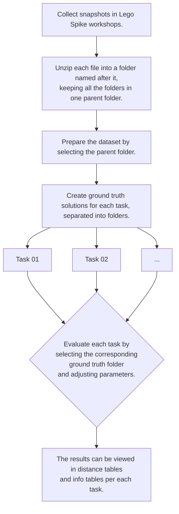

# Spike Auto Assessment And Data Mining
Automatic assessment and data mining of projects created within the Spike app designed to operate the Spike Prime educational robots. Projects are evaluated through comparison of their text equivalents with established, correct solutions. Parameters of evaluation and distance to the correct solution are adjustable. 
## Requirements
The project was built using Python version 3.10. The programs require additional packages: **anytree**, **levenshtein**, **pandas**, **pyyaml**, **tqdm**, **watchdog**. The command **pip** can be used to install the packages thusly:

    pip install anytree levenshtein pandas pyyaml tqdm watchdog

## Working directories 
Working directories are defined in **paths.yml**. The initial directory is set to **Documents/Spike Data**. The subfolders are:

 - **Projects** which will contain the parsed snapshots inside *json* files named after the student IDs,
 - **Parameters** which is the suggested location for saving parameters of evaluation, 
 - **Trees** which will contain the tree files adjusted for the assessment of a task,
 - **Distances** which will contain *csv* tables displaying the minimal distance of each student from the nearest correct solution, and 
 - **Info** which will contain *csv* tables with the information about the students' solution.

## Snapshots collection
Snapshots are collected by running **collect_snapshots.py** in the background for the duration of the workshop. Snapshots will be packaged into a *zip* file for a convenient transfer.
## Project files preparation
Initial dataset preparation is performed using **prepare_dataset.py**. Choosing a folder containing extracted snapshots of the workshop sorted into folders by student IDs will produce student files in the **Projects** folder in the working directory. 
## Assessment and data mining
A folder needs to be created for each task, which contains a set of correct solutions to be used by **assess_task.py**, where parameters for evaluation are chosen. The parameters are as follows:

 - **Clean up**: if checked, blocks that are not attached to an event block will be discarded.
 - **Only keep present blocks**: if checked, blocks that are not present in ground truth examples will be discarded.
 - **Flexible**: the values of the checked blocks will not affect the assessment.
 - **Use data from all students**: if checked, data from all of the students will be used for data mining, not just from the students that have correctly solved the task.
 - **Categorize last data point only**: if checked, only blocks from the last snapshot will be categorized, instead of using all of the prior snapshots as well.
 - **Maximum distance**: maximum number of insertions, removals or replacements of a character needed to transform a student's snapshot in form of the text equivalent to match the nearest ground truth example. For instance, setting the maximum distance to 0 will only allow the solutions that are identical to the ground truth examples to be graded as correct. Setting the maximum distance to 2 will allow, for instance, setting the number of rotations of a motor to 5 where 10 in expected.

The parameters of evaluation are task-specific. Results of evaluation are displayed in the console and stored in tables in the working directory.
## Step-by-step solution

## Tree viewing
Trees created for assessment from the original snapshots can be viewed using **tree_viewer.py**.
